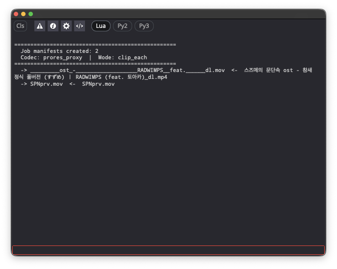
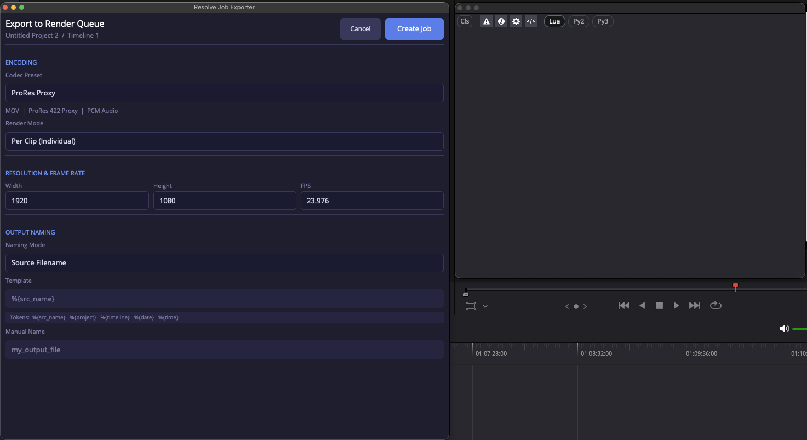
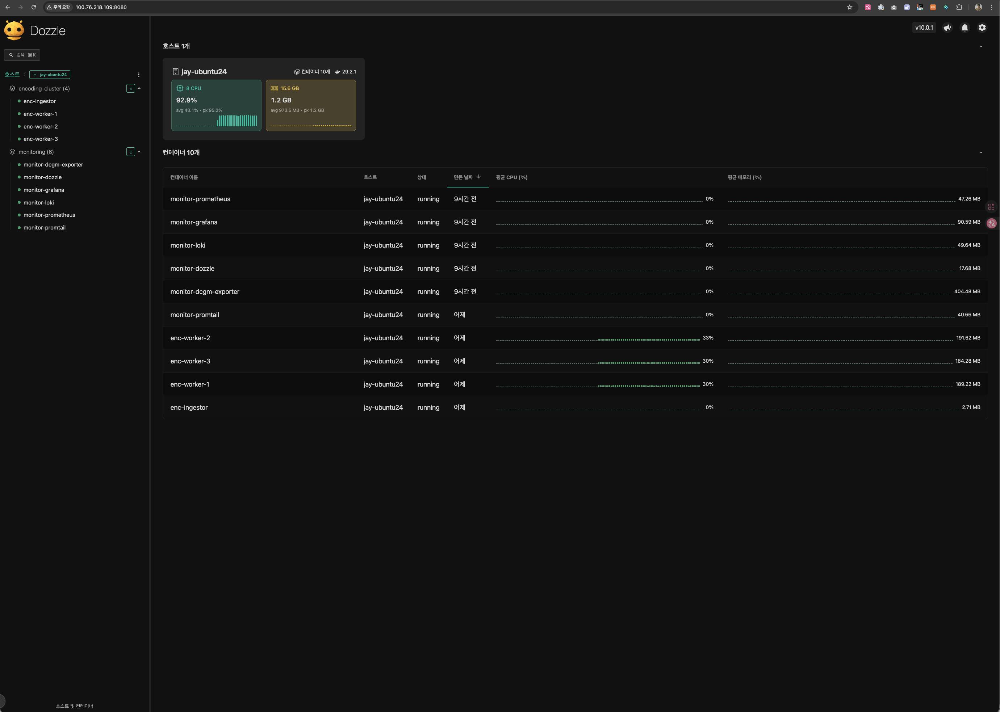
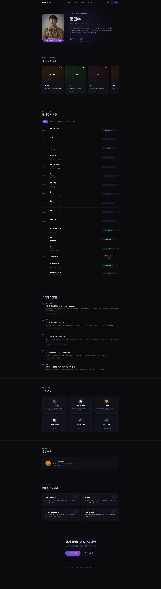
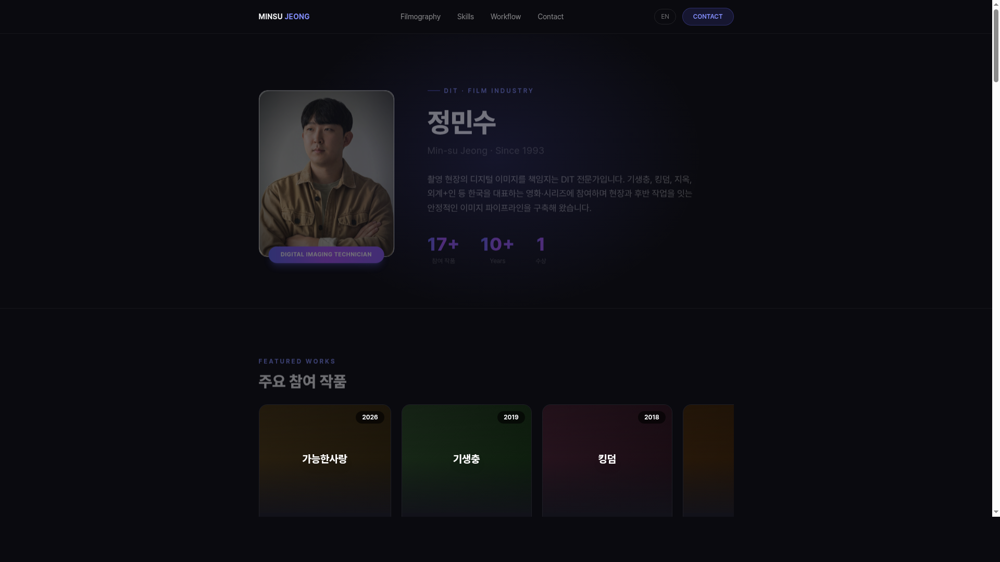
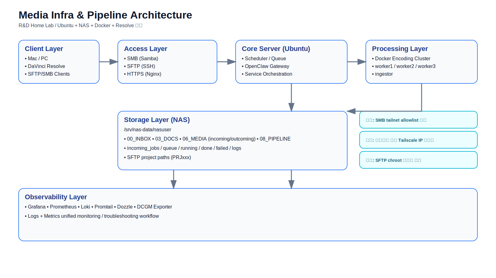

# Media Infra & Pipeline Portfolio (Public)

이 저장소는 채용/포트폴리오 공개용으로 민감정보를 제거한 버전입니다.

## 미리보기 (핵심 스크린샷)

### 1) DaVinci Resolve Consol

### 2) Export to Render Queue

### 3) Pipeline Log Monitoring (Dozzle)

### 4) Portfolio Full View

### 5) Portfolio Latest View

### 6) Architecture Diagram

---

## Included
- 아키텍처/운영 문서
- 파이프라인 스크립트(핵심 로직)
- 모니터링/인코딩 구성 예시

## Redacted
- 실도메인/IP/계정/토큰/절대경로
- 실서비스 Nginx 상세 설정

## Key Achievements
- Resolve -> Job -> Scheduler -> Worker -> Output E2E 자동화
- SMB/SFTP 권한/경로 이슈 해결 경험
- Monitoring stack (Grafana/Prometheus/Loki/Dozzle/DCGM) 운영
